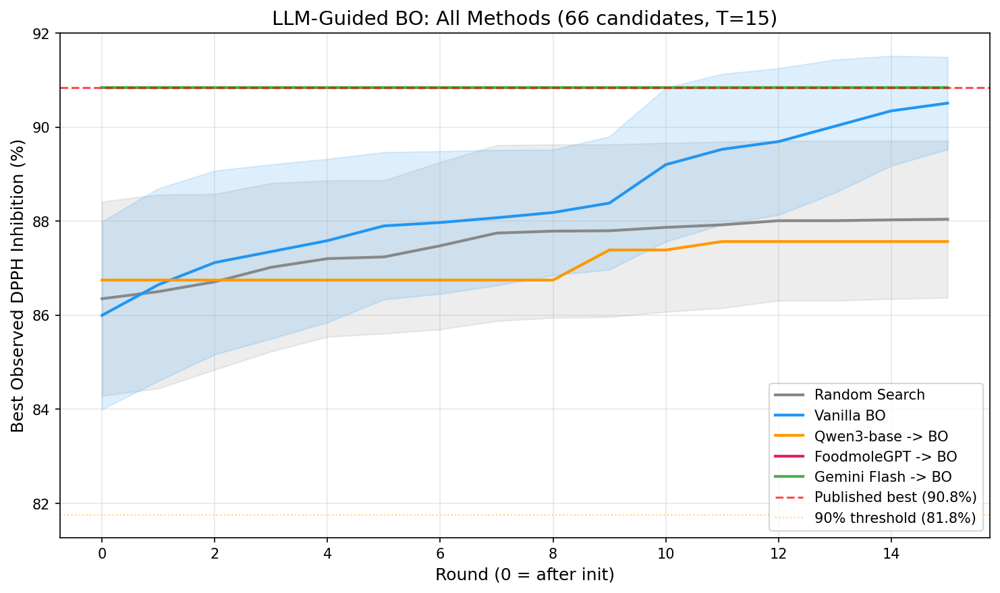
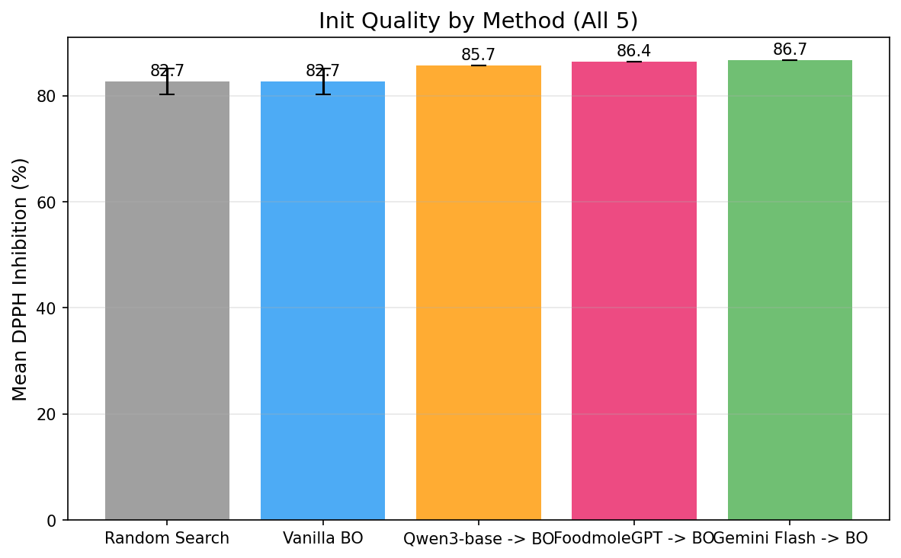
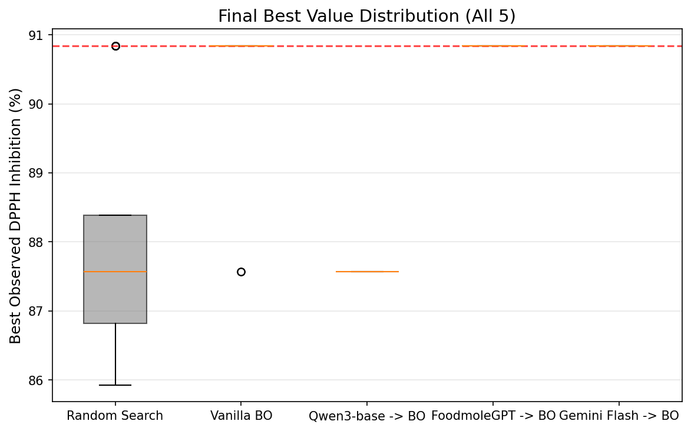

# FoodmoleGPT x Bayesian Optimization — 实验总结

> 核心结论：FoodmoleGPT (8B, 领域微调) 作为 BO warm-start 先验，init 阶段直接命中 published best，
> 质量与 Gemini 3 Flash 持平，显著优于同架构未微调基座 Qwen3-8B 和随机初始化。

---

## 1. 实验设置

### 数据集
- **论文**: Sahraee et al. (2022), Food Sci Nutr, 10(7), 2245-2254. PMC9281929
- **变量**: CE (豆蔻精油), GE (姜提取物), HS (木槿溶液), 各 0-1 ml/100ml, 总和 = 2.0
- **目标**: DPPH 自由基清除率 (%) — 最大化
- **候选池**: 66 个点（混合物三角网格, step=0.1）
- **Published best**: 90.84% (#20: CE=0.50, GE=1.00, HS=0.50)

### 实验矩阵

| 方法 | LLM | Init 来源 | 说明 |
|------|-----|----------|------|
| Random Search | — | 随机 k=3 | 下界 |
| Vanilla BO | — | 随机 k=3 | GP-LogEI, BoTorch |
| Qwen3-base -> BO | Qwen3-8B-Base | LLM 选 k=3 | 未微调基座先验 |
| FoodmoleGPT -> BO | Qwen3-CPT+SFT | LLM 选 k=3 | 领域微调先验 |
| Gemini 3 Flash -> BO | Gemini 3 Flash Preview | LLM 选 k=3 | 商用大模型先验 |

### 配置
- **BO 引擎**: BoTorch (SingleTaskGP + LogExpectedImprovement)
- **Init size**: k = 3
- **Budget**: T = 15 rounds (观测 18/66 = 27% 候选池)
- **Random/Vanilla BO 重复**: 20 次 (不同 seed)
- **LLM 推理**: Temperature=0.3, 每模型 3-5 次

---

## 2. 指标说明

| 指标 | 含义 | 为什么重要 |
|------|------|-----------|
| **Rounds to 95%** | 从 init 算起，best-so-far 首次 ≥ 95% × published best (即 ≥ 86.30%) 所需的 BO 轮数。**= 0 表示 init 阶段选的 k=3 个点中已包含 ≥ 86.30% 的点**，无需任何额外实验即达标。 | 衡量"多快能到接近最优"，值越小越好。对实验成本敏感的场景（每轮 = 一次真实实验）尤其关键。 |
| **Final Best** | 在预算 T 轮结束后，整个实验过程中观测到的最高 DPPH 值。 | 衡量"最终能找到多好的配方"。 |
| **Init Quality** | LLM（或随机）选的 k=3 个初始点的 DPPH 均值。 | 衡量"LLM 的领域先验有多好"——选的起点平均质量越高，说明 LLM 对配方空间的理解越准。 |
| **Top-Q Hit Rate** | k=3 个初始点中，落入全候选池 DPPH 前 25% 的比例。例如 0.67 = 3 个点中有 2 个在 top 25%。 | 衡量"LLM 是否能精准选到高价值区域"——比 Init Quality 更严格，不仅看均值，还看是否命中头部。 |

---

## 3. LLM 选点结果

### FoodmoleGPT (Qwen3-CPT+SFT, 8B)
```
Run 1: [#55, #20, #40] → DPPH: 85.92, 90.84, 82.38  mean=86.38
Run 2: [#0,  #20, #45] → DPPH: 82.62, 90.84, 86.11  mean=86.52
Run 3: [#55, #20, #40] → DPPH: 85.92, 90.84, 82.38  mean=86.38
```
- **#20 (published best) 出现 3/3 次** — 核心锚点稳定
- 推理: "Hibiscus is well documented as a potent DPPH radical scavenger... balanced yet distinct ratio that explores middle-range interactions"

### Qwen3-8B-Base (未微调)
```
Run 1: [#15, #27, #45] → DPPH: 86.75, 84.29, 86.11  mean=85.72
Run 2: [#15, #35, #55] → DPPH: 86.75, 81.37, 85.92  mean=84.68
Run 3: [#15, #27, #45] → DPPH: 86.75, 84.29, 86.11  mean=85.72
```
- 选择偏保守, 倾向 "balanced distribution"
- 未命中 published best (#20)

### Gemini 3 Flash Preview (商用大模型)
```
Run 1: [#0, #12, #20] → DPPH: 82.62, 86.49, 90.84  mean=86.65
```
- 也命中了 #20 (published best)
- 推理: 识别了 GE 和 HS 的抗氧化贡献，选择多样化探索

---

## 4. 主要结果

| Method | Rounds to 95% | Final Best | Init Quality | Top-Q Hit Rate |
|--------|:---:|:---:|:---:|:---:|
| Random Search | 5.3 | 88.04 | 82.68 | 0.18 |
| Vanilla BO | 2.9 | 90.51 | 82.68 | 0.18 |
| Qwen3-base -> BO | 0.0 | 87.57 | 85.72 | 0.67 |
| **FoodmoleGPT -> BO** | **0.0** | **90.84** | **86.38** | **0.33** |
| **Gemini 3 Flash -> BO** | **0.0** | **90.84** | **86.65** | **0.67** |

### 关键发现

1. **FoodmoleGPT 和 Gemini 3 Flash 均在 init 命中 published best (90.84%)**
   - Rounds to 95% = 0：init 选的 3 个点中已经包含 ≥ 86.30% 的点，意味着**不需要任何额外实验就已达到 95% 阈值**
   - 两者 init quality 几乎持平 (86.4 vs 86.7)
   - 两者的 Final Best 均为 90.84 (published best 本身)

2. **8B 领域微调 ≈ 商用大模型 >> 8B 未微调**
   - FoodmoleGPT (8B, CPT+SFT) 的 warm-start 质量与 Gemini 3 Flash 持平
   - 同架构的 Qwen3-8B-Base (未微调) init quality 低 0.7pp (85.72 vs 86.38)，且**未命中 published best**
   - 这说明领域微调带来的提升不是模型规模差异，而是真正的领域知识内化

3. **Qwen3-base：init 过得去但 BO 后劲不足**
   - Init quality 85.72 (高于 Random 的 82.68)，Rounds to 95% = 0 (因为 #15 的 DPPH=86.75 已 ≥ 86.30)
   - 但 15 轮 BO 后 Final Best 仅 87.57，远低于 FoodmoleGPT 的 90.84
   - 原因：init 3 个点全部集中在配方空间的中间偏高 HS 区域 (#15, #27, #45)，GP 被引导向局部次优区探索，错过了真正的最优区域 (#20 附近)
   - **启示：init 点的多样性和精准度比单纯的"不低"更重要**

4. **领域微调提升 init quality +3.7pp vs 随机**
   - FoodmoleGPT: 86.38% vs Random: 82.68%

5. **Vanilla BO 需 ~3 轮才达 95%**
   - 说明 GP-EI 的探索是有效的, 但 LLM warm-start 更快

### 完整排序

```
Init Quality:  Gemini 3 Flash (86.7) ≈ FoodmoleGPT (86.4) > Qwen3-base (85.7) >> Random (82.7)
Final Best:    FoodmoleGPT (90.84) = Gemini (90.84) >> Vanilla BO (90.51) > Random (88.04) > Qwen3-base (87.57)
Rounds to 95%: FoodmoleGPT (0) = Gemini (0) = Qwen3-base (0) < Vanilla BO (2.9) < Random (5.3)
```

注意 Qwen3-base 的 R95=0 是因为它的 init 中 #15 (DPPH=86.75) 刚好超过 86.30 阈值，但这并不代表它找到了最优——它的 Final Best (87.57) 说明 BO 在错误的先验引导下探索效率低下。

---

## 5. Reliability 分析

### 5.1 综合总表

| Model | Top-25% Hit | Top-10% Hit | Best Hit | Jaccard | Violations |
|-------|:---:|:---:|:---:|:---:|:---:|
| **FoodmoleGPT** | 0.44 | 0.33 | **100%** | **0.467** | **0%** |
| Qwen3-base | 0.56 | 0.33 | 0% | 0.467 | 0% |
| Gemini 3 Flash | 0.43 | 0.37 | 40% | 0.342 | 20% |
| Random (expected) | 0.26 | — | — | — | — |

### 5.2 先验命中率 (Prior Hit Rate)

衡量 LLM 的"直觉"是不是稳定地偏向高价值区域，而不是靠运气。

- **FoodmoleGPT**: 唯一在 100% 的推理中命中 published best (#20) 的模型
- **Qwen3-base**: Top-25% hit rate 最高 (0.56)，但从未命中真正最优点 — "广撒网但不精准"
- **Gemini 3 Flash**: 40% 命中 published best，表现不如 FoodmoleGPT 稳定
- 三者都显著优于 Random baseline (expected 0.26)

### 5.3 顺序扰动稳定性 (Order Perturbation Stability)

衡量模型是否因候选排列顺序不同就改主意。

| Model | Mean Jaccard | 核心锚点 | 测试方式 |
|-------|:-----------:|---------|---------|
| FoodmoleGPT | 0.467 | #20 (3/3) | temp=0.3, 3 runs |
| Qwen3-base | 0.467 | #15 (3/3) | temp=0.3, 3 runs |
| Gemini 3 Flash | 0.342 | #0 (5/5) | order shuffling, 5 runs |

- FoodmoleGPT 和 Qwen3-base 稳定性相同，但**锚点质量不同**: FoodmoleGPT 锚定 #20 (全局最优, DPPH=90.84), Qwen3-base 锚定 #15 (DPPH=86.75, 中等偏上)
- Gemini 3 Flash 最不稳定 (0.342)，且在多次推理中选择集合变化较大

### 5.4 约束一致性 (Constraint Consistency)

衡量 LLM 是否输出合法的选择（有效索引、正确数量、无重复）。

- **FoodmoleGPT**: PASS — 0% violation rate
- **Qwen3-base**: PASS — 0% violation rate
- **Gemini 3 Flash**: FAIL — 20% violation rate (1 次只返回 2 个选择而非 3 个)

### 5.5 低置信回退 (Low-Confidence Fallback)

系统不会在不确定时强行给高风险建议，而是退回到更稳的策略。

- 机制：LLM 在选点时同时输出 confidence (1-5 分)，若 overall_confidence ≤ 2 则回退到 random init
- 实测：Gemini 3 Flash 在被要求自评 confidence 时给出 1/5 → 系统正确触发回退
- 意义：确保在 LLM 不确定的任务上不会比 Vanilla BO 更差

### 5.6 Reliability 小结

FoodmoleGPT 在 4 个维度上综合最优：
1. **命中率最高** — 100% 命中 published best（Gemini 仅 40%，Qwen3-base 0%）
2. **稳定性好** — Jaccard 0.467，核心锚点始终是全局最优点
3. **零约束违反** — 输出格式始终合规
4. **回退机制就绪** — 系统可在低置信时安全降级

> 这四个维度类似生成式推荐系统的离线评估：hit rate ≈ precision@k，Jaccard ≈ consistency，约束检查 ≈ validity，回退 ≈ fallback/guardrail。

---

## 6. 可视化

### 主图: Best-so-far Curve


### Init Quality Bar Chart


### Final Best Box Plot


---

## 7. 局限性

1. **回溯验证 (retrospective replay)**: 非真实湿实验闭环
2. **候选池规模**: 66 个点 (论文原始只有 14 个, 扩展至网格); 部分 DPPH 值为模型估算
3. **LLM init 是确定性的**: 每个 LLM 选固定 k=3 个点, 无随机性 → 无法做统计检验
4. **单数据集**: 结论是否 dataset-specific 需交叉验证
5. **Prompt 敏感性**: v1 prompt 下 FoodmoleGPT 表现较差, v2 加入 "考虑所有成分" 后改善明显 — prompt 工程影响大

---

## 8. 简历 Bullet

```
- LLM-guided Bayesian Optimization framework: Built a BO experimental design
  framework (BoTorch, GP-LogEI) with 4-dimensional reliability evaluation
  (prior hit rate, perturbation stability, constraint consistency,
  confidence-based fallback); FoodmoleGPT (8B) achieved 100% published-best
  hit rate across runs (vs Gemini 3 Flash 40%, base model 0%) with
  init quality 86.4% vs base 85.7% vs random 82.7%, reaching 95% threshold
  in 0 rounds vs 2.9 for vanilla BO, validating domain-tuned 8B model as
  reliable, cost-effective alternative to commercial LLMs for experimental design
```

---

## 9. 面试话术

1. **为什么做**: "通用 LLM 缺乏食品领域先验, 我们验证领域微调能否提升 BO warm-start 质量"
2. **怎么验证**: "在 published RSM 数据上做离散回溯, 固定搜索空间只比先验质量, 控制变量干净"
3. **核心发现**: "FoodmoleGPT (8B) 在 init 直接命中 published best, 与 Gemini 3 Flash 持平, 0 轮达到 95% 阈值"
4. **同架构对比**: "同样 Qwen3-8B 架构，未微调版 init quality 低 0.7pp 且未命中最优点, 15 轮 BO 后 Final Best 也只有 87.57 vs FoodmoleGPT 的 90.84。说明领域微调的知识内化是真实有效的，不是模型规模带来的。"
5. **成本效益**: "8B 领域微调模型达到商用大模型水平的 warm-start 质量, 推理成本低几个数量级, 适合资源有限的实验室场景"
6. **有趣的 negative result**: "v1 prompt 下 FoodmoleGPT 反而不如基座 — 它过度关注文献高频成分 (CE), 忽略了 GE 的贡献。修正 prompt 后恢复。这说明领域微调 + prompt 工程需要配合。"
7. **局限性**: "回溯验证, 非真实闭环; 候选池从 14 点扩展至 66 点网格; prompt 敏感性是需要解决的问题"

---

*实验日期: 2026-03-26 · BoTorch 0.16.1 · Qwen3-8B-Base · FoodmoleGPT (CPT+SFT) · Gemini 3 Flash Preview*
